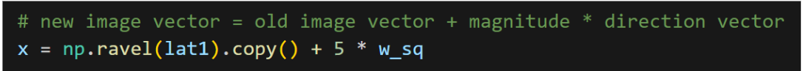
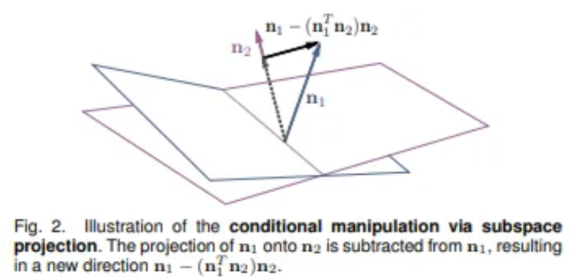
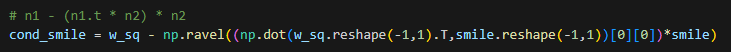

# Controlling Memorability of Face Images
Vector Internship 2023, Exploratory Work

The contents of this Github Repo includes:
1. Summary slides containing the results of this exploratory work.
2. A summary report giving more context to the slides.
3. A combined jupyter's notebook meant to be used as a reference on how vectors/latents were manipulated.
    - **(DO NOT RUN DIRECTLY)**
5. Various direction vectors that can be used to modify semantic traits.

If one would like to begin exploring this topic, it is recommended to read the related works mentioned in the report and start with the supplementary materials provided at: https://openreview.net/forum?id=tm9-r3-O2lt

Below are some base instructions to help you get started with the above materials.

## How to Modify Memorability (or any trait)

The direction vector, multiplied by a magnitude of either direction, must be added to the image vector following the formula w-edit= w+αw∗. 

In the supplementary materials the memorability direction vector is represented by the variable w_sq as shown in the screenshot below.

## How to Conditionally Modify Memorability (or any trait)

To modify the memorability of an image while keeping another trait constant, subspace projection must be done. 

A new direction vector is created through subspace projection of two traits as seen below.

This new direction vector (cond_smile) can be applied just as the original. This example in particular will modify memorability (w_sq) without modifying smile.
